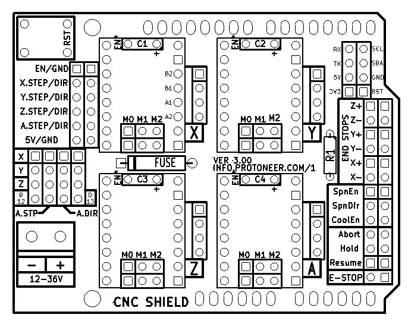
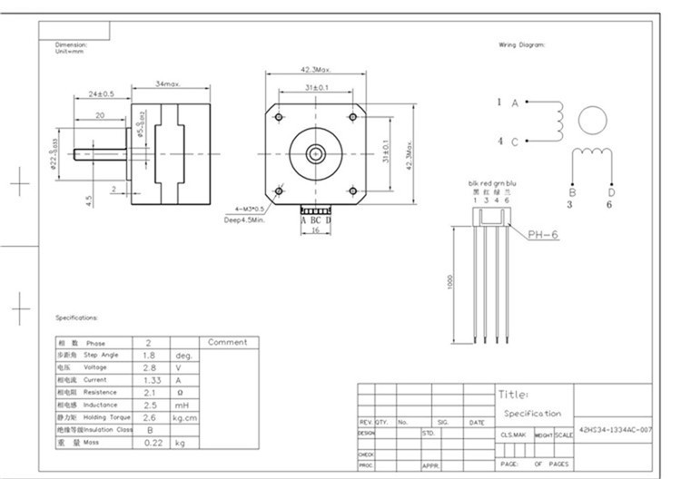
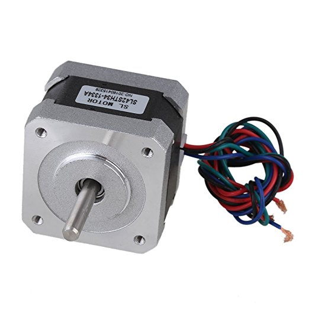
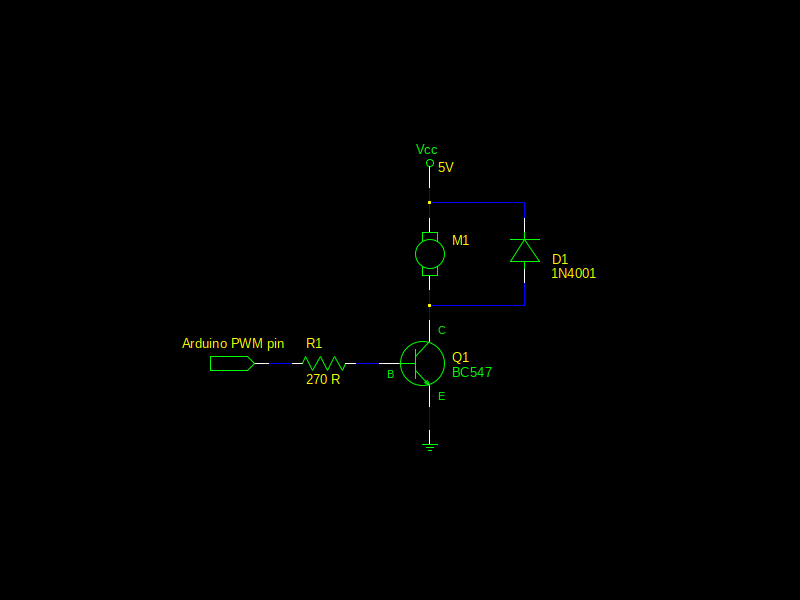

# Escriba Mark I - Light CNC

[Main page]

## Electronics

### Power supply
Technical specifications:
- Voltage: 12 VDC
- Amperage: 5 A
- Interface: P8 (+ out, - in)

### Arduino
Technical specifications:
- Model: [Arduino Uno] R3

#### Diagram
                                 .-----.
    .----[PWR]-------------------| USB |--.
    |                            '-----'  |
    |         GND/RST2  [ ][ ]            |
    |       MOSI2/SCK2  [ ][ ]  A5/SCL[ ] |   C5
    |          5V/MISO2 [ ][ ]  A4/SDA[ ] |   C4
    |                             AREF[ ] |
    |                              GND[ ] |
    | [ ]NC                     SCK/13[ ] |   B5
    | [ ]v.ref                 MISO/12[ ] |   .
    | [ ]RST                   MOSI/11[ ]~|   .
    | [ ]3V3    +---+               10[ ]~|   .
    | [ ]5v     | A |                9[ ]~|   .
    | [ ]GND   -| R |-               8[ ] |   B0
    | [ ]GND   -| D |-                    |
    | [ ]Vin   -| U |-               7[ ] |   D7
    |          -| I |-               6[ ]~|   .
    | [ ]A0    -| N |-               5[ ]~|   .
    | [ ]A1    -| O |-               4[ ] |   .
    | [ ]A2     +---+           INT1/3[ ]~|   .
    | [ ]A3                     INT0/2[ ] |   .
    | [ ]A4/SDA  RST SCK MISO     TX>1[ ] |   .
    | [ ]A5/SCL  [ ] [ ] [ ]      RX<0[ ] |   D0
    |            [ ] [ ] [ ]              |
    '--.                         .--------'
        \_______________________/

Diagram by http://busyducks.com/ascii-art-arduinos

#### Pin designation
 id | pin |   type    | direction |               description
----|-----|-----------|-----------|--------------------------------------------
  0 |   0 | digital   | input     | Serial communication
  1 |   1 | digital   | output    | Serial communication
  2 |   0 | digital   | output    | Step Pulse x-axis
  3 |   3 | digital   | output    | Step Pulse y-axis
  4 |   4 | digital   | output    | Step Pulse z-axis
  5 |   5 | digital   | output    | Direction x-axis
  6 |   6 | digital   | output    | Direction y-axis
  7 |   7 | digital   | output    | Direction z-axis
  8 |   8 | digital   | output    | Stepper Enable/Disable
  9 |   9 | digital   | input     | Limit x-axis
 10 |  10 | digital   | input     | Limit y-axis
 11 |  11 | PWM       | input     | Limit z-axis
 12 |  12 | digital   | output    | Spindle Enable
 13 |  13 | digital   | output    | Spindle Direction
 14 |   0 | digital   | input     | Reset/Abort
 15 |   1 | digital   | input     | Feed Hold
 16 |   2 | digital   | input     | Cycle Start/Resume
 17 |   3 | digital   | output    | Coolant Enable
 18 |   4 | digital   | input     | (not used/reserved)
 19 |   5 | digital   | input     | Probe

### CNC Shield

[CNC/Stepper Motor Shield](../Documents/cnc-3axis-shield.pdf)

Technical specifications:
- Version: 3.00

Connected at:
- Arduino: Digital Pin 11
- CNC Shield: Z+ end stop pin

### Stepper drivers
CNC Shield has 3 jumpers to configure each axes resolution.
That can be set to configure the motor micro stepping.

#### Resolution configuration

##### Pololu A4988
 M0   | M1   | M2   | Microstep resolution
------|------|------|-----------------------
 Low  | Low  | Low  | Full step
 High | Low  | Low  | Half step
 Low  | High | Low  | Quarter step
 High | High | Low  | Eighth step
 High | High | High | Sixteenth step

##### Pololu DRV8825
 M0   | M1   | M2   | Microstep resolution
------|------|------|-----------------------
 Low  | Low  | Low  | Full step
 High | Low  | Low  | Half step
 Low  | High | Low  | 1/4 step
 High | High | Low  | 1/8 step
 Low  | Low  | High | 1/16 step
 High | Low  | High | 1/32 step
 Low  | High | High | 1/32 step
 High | High | High | 1/32 step

### Step motors

Technical specifications:
- Model: JK42HS34-1334AC
- Phase: 2
- Step angle: 1.8 degrees (200 steps/revolution)
- Rated voltage: 2.8 V
- Current/Phase: 1.33 A
- Resistance/Phase: 2.1 Ω
- Inductance/Phase: 2.5 mH
- Holding Torque: 22 N·cm (2.6 kg·cm)
- Outlet: 4 wires
- Shaft: 5 mm single flat
- Size (metric): 4.2 cm x 4.2 cm x 3.4 cm
- Size (imperial): 1.65" x 1.65" x 1.34"

### Fan driver

[Fan driver schematic](fan_driver.sch) file (gEDA - GPL Electronic Design Automation).

[Main page]

---

[Arduino Uno]: https://www.arduino.cc/en/Main/arduinoBoardUno/#techspecs
[Main page]: ../README.md
