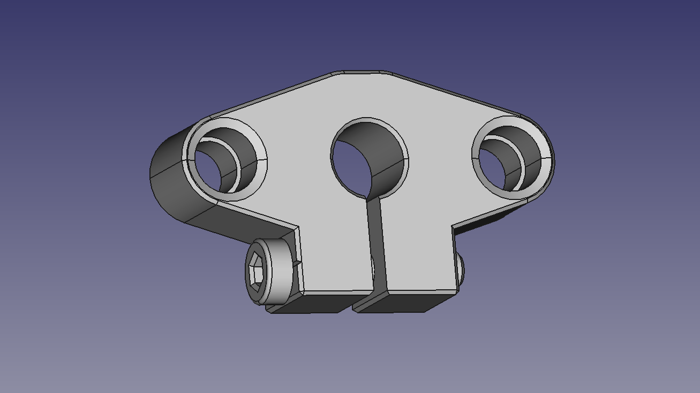
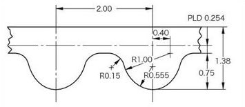

# Escriba Mark I - Light CNC

[Main page]

## Mechanics

### Technical specifications

Dimensions:
- Width:  mm
- Height:  mm
- Depth:  mm

Mass:
- Weight:  g (calculated)

Maximum travel:
- x axis: 394,20 mm (calculated)
- y axis: 213.15 mm (calculated)
- z axis: 0.0 mm (calculated)

### Parts

#### SHF8

Technical specifications:
- Shaft: 8 mm
- Fastener: M5
- Material: aluminium

#### SC8VUU
Technical specifications:
- Shaft: 8 mm
- Fastener: M3
- Material: aluminium
- System: LM8UU

#### Belt

Technical specifications:
- Standard: GT2
- Pinch: 2 mm
- Wide: 6 mm
- Lenght:  mm

#### Noise reduction

[Main page]

---
[Main page]: ../README.md
