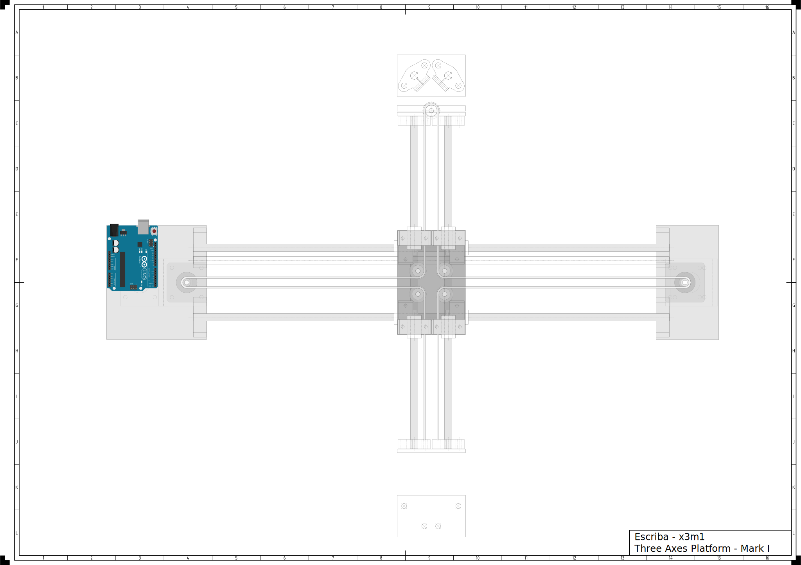
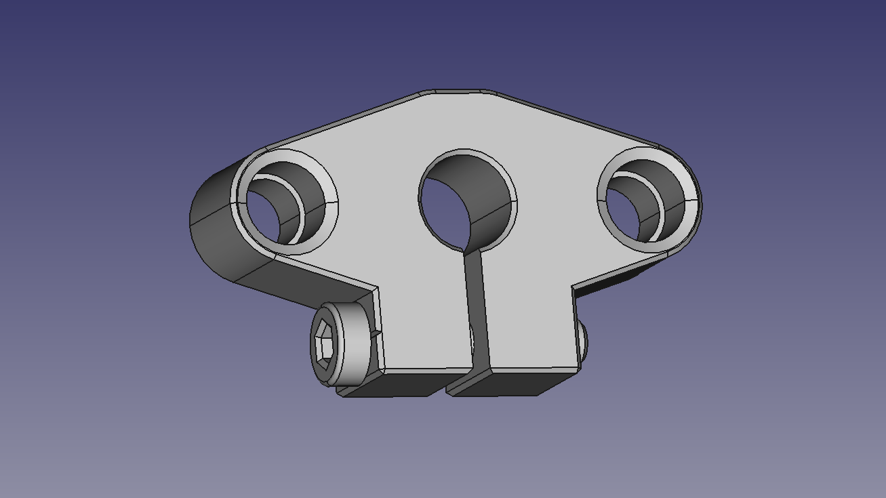
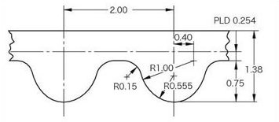
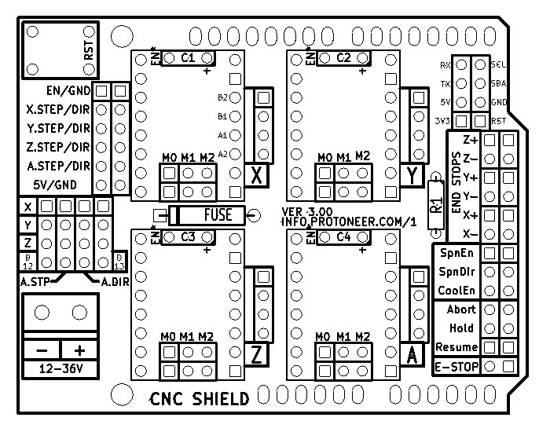
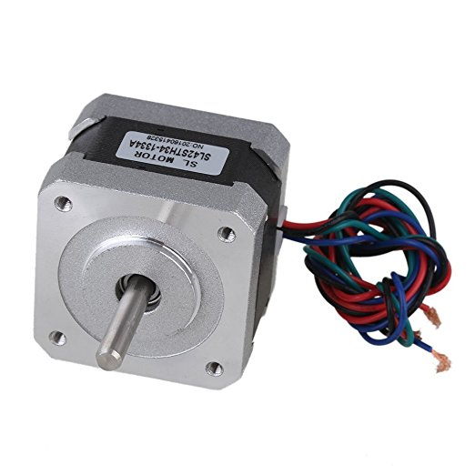
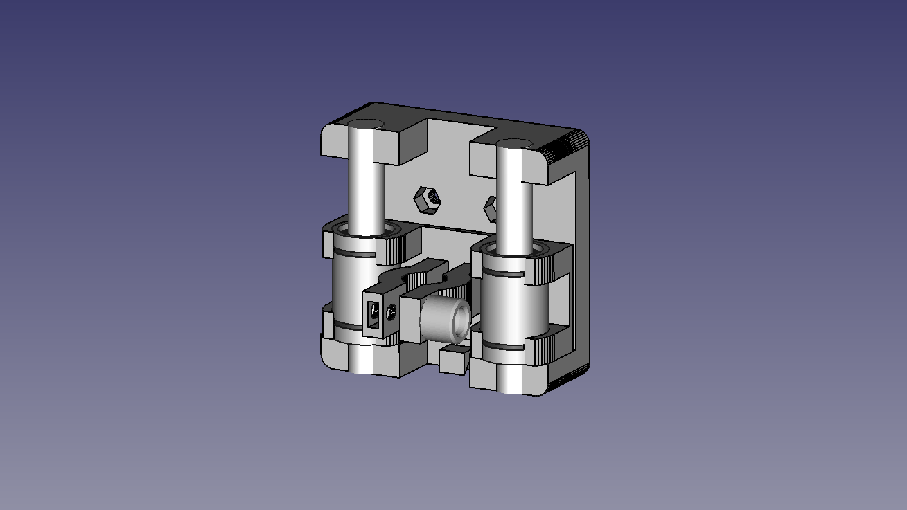
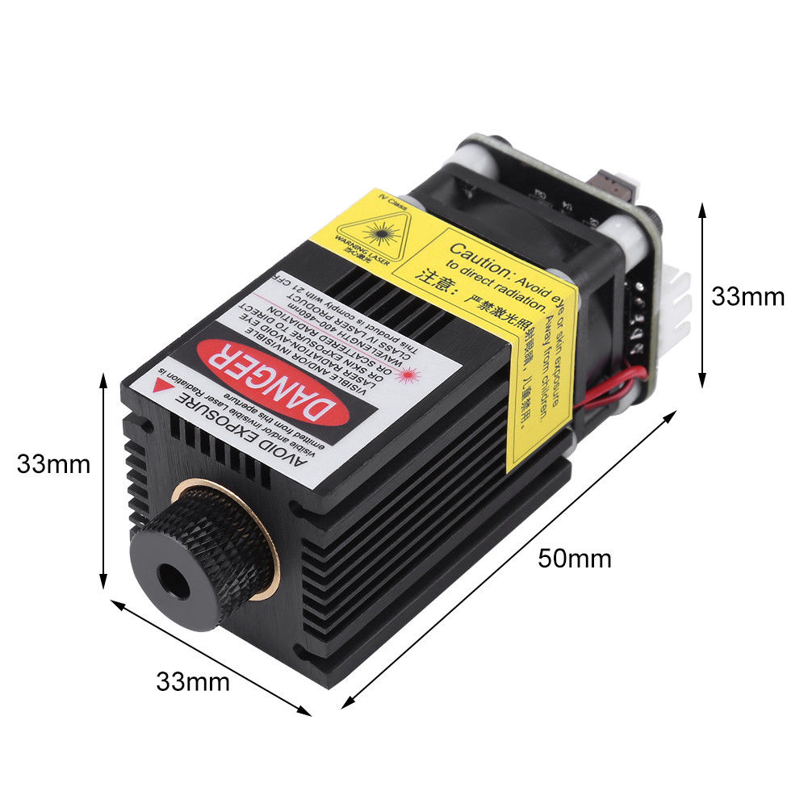

# Escriba Mark I - Ploter

Márcio Pessoa
2017-09-16

[Change log](CHANGELOG.md)

[Bill of materials](BOM.md)

[Kanban](KANBAN.md)

# Mechanics

## Maximum travel
- x axis: 394,20 mm
- y axis: 213.15 mm
- z axis: 0,0 mm

### SHF

SHF8 technical specifications:
- Shaft: 8 mm
- Fastener: M5

### SC8VUU
Linear Ball Bearing Pellow Bolck With LM8UU For CNC

## Belt

Belt technical specifications:

## Noise reduction

# Electronics

## Arduino
[#Arduino_Uno_R3] technical specifications:
- 

### Diagram

    
                                          .-----.                     
             .----[PWR]-------------------| USB |--.                  
             |                            '-----'  |                  
             |         GND/RST2  [ ][ ]            |                  
             |       MOSI2/SCK2  [ ][ ]  A5/SCL[ ] |   C5             
             |          5V/MISO2 [ ][ ]  A4/SDA[ ] |   C4             
             |                             AREF[ ] |                  
             |                              GND[ ] |                  
             | [ ]NC                     SCK/13[ ] |   B5             
             | [ ]v.ref                 MISO/12[ ] |   .              
             | [ ]RST                   MOSI/11[ ]~|   .              
             | [ ]3V3    +---+               10[ ]~|   .              
             | [ ]5v     | A |                9[ ]~|   .              
             | [ ]GND   -| R |-               8[ ] |   B0             
             | [ ]GND   -| D |-                    |                  
             | [ ]Vin   -| U |-               7[ ] |   D7             
             |          -| I |-               6[ ]~|   .              
             | [ ]A0    -| N |-               5[ ]~|   .              
             | [ ]A1    -| O |-               4[ ] |   .              
             | [ ]A2     +---+           INT1/3[ ]~|   .              
             | [ ]A3                     INT0/2[ ] |   .              
             | [ ]A4/SDA  RST SCK MISO     TX>1[ ] |   .              
             | [ ]A5/SCL  [ ] [ ] [ ]      RX<0[ ] |   D0             
             |            [ ] [ ] [ ]              |                  
             '--.                         .--------'                  
                 \_______________________/                            
                                                                      
    

Arduino Uno R3 diagram by http://busyducks.com/ascii-art-arduinos

### Pin designation

Table [pins] shows pin designation.

| id | pin |   type    | direction |               description                |
|----|-----|-----------|-----------|------------------------------------------|
|  0 |   0 | digital   | input     | Serial communication                     |
|  1 |   1 | digital   | output    | Serial communication                     |
|  2 |   0 | digital   | output    | Step Pulse x-axis                        |
|  3 |   3 | digital   | output    | Step Pulse y-axis                        |
|  4 |   4 | digital   | output    | Step Pulse z-axis                        |  
|  5 |   5 | digital   | output    | Direction x-axis                         |
|  6 |   6 | digital   | output    | Direction y-axis                         |
|  7 |   7 | digital   | output    | Direction z-axis                         |
|  8 |   8 | digital   | output    | Stepper Enable/Disable                   |
|  9 |   9 | digital   | input     | Limit x-axis                             |
| 10 |  10 | digital   | input     | Limit y-axis                             |
| 11 |  11 | digital   | input     | Limit z-axis                             |
| 12 |  12 | digital   | output    | Spindle Enable                           |
| 13 |  13 | digital   | output    | Spindle Direction                        |
| 14 |   0 | digital   | input     | Reset/Abort                              |
| 15 |   1 | digital   | input     | Feed Hold                                |
| 16 |   2 | digital   | input     | Cycle Start/Resume                       |
| 17 |   3 | digital   | output    | Coolant Enable                           |
| 18 |   4 | digital   | input     | (not used/reserved)                      |
| 19 |   5 | digital   | input     | Probe                                    |

## CNC Shield

[CNC/Stepper Motor Shield](Documents/cnc-3axis-shield.pdf)

## Step motors

NEMA 17 stepper motor technical specifications:
- Model: JK42HS34-1334AC
- Phase: 2
- Step angle: 1.8 degrees (200 steps/revolution)
- Rated voltage: 2.8 V
- Current/Phase: 1.33 A
- Resistance/Phase: 2.1 Ω
- Inductance/Phase: 2.5 mH
- Holding Torque: 22 N·cm (2.6 kg·cm)
- Outlet: 4 wires
- Shaft: 5 mm single flat
- Size (metric): 4.2 cm x 4.2 cm x 3.4 cm
- Size (imperial): 1.65" x 1.65" x 1.34"

# Software

## Grbl
> "Grbl is a no-compromise, high performance, low cost alternative to parallel-port-based motion control for CNC milling. It will run on a vanilla Arduino (Duemillanove/Uno) as long as it sports an Atmega 328. 
> 
> The controller is written in highly optimized C utilizing every clever feature of the AVR-chips to achieve precise timing and asynchronous operation. It is able to maintain up to 30kHz of stable, jitter free control pulses.
> 
> It accepts standards-compliant g-code and has been tested with the output of several CAM tools with no problems. Arcs, circles and helical motion are fully supported, as well as, all other primary g-code commands. Macro functions, variables, and most canned cycles are not supported, but we think GUIs can do a much better job at translating them into straight g-code anyhow.
> 
> Grbl includes full acceleration management with look ahead. That means the controller will look up to 18 motions into the future and plan its velocities ahead to deliver smooth acceleration and jerk-free cornering."
> 
> -- From: [GRBL web page]

### Configuring
[Configuring][Grbl_configuring]

### G-Code
List of Supported G-Codes in Grbl v0.9 Master:
  - Non-Modal Commands: G4, G10L2, G10L20, G28, G30, G28.1, G30.1, G53, G92, G92.1
  - Motion Modes: G0, G1, G2, G3, G38.2, G38.3, G38.4, G38.5, G80
  - Feed Rate Modes: G93, G94
  - Unit Modes: G20, G21
  - Distance Modes: G90, G91
  - Arc IJK Distance Modes: G91.1
  - Plane Select Modes: G17, G18, G19
  - Tool Length Offset Modes: G43.1, G49
  - Cutter Compensation Modes: G40
  - Coordinate System Modes: G54, G55, G56, G57, G58, G59
  - Control Modes: G61
  - Program Flow: M0, M1, M2, M30*
  - Coolant Control: M7*, M8, M9
  - Spindle Control: M3, M4, M5
  - Valid Non-Command Words: F, I, J, K, L, N, P, R, S, T, X, Y, Z

# Tools

## Pen holder

Pen holder tecnical specifications:
- Material: ABS (3D printed) and steel

## Laser

- Cut
  - Paper
  - Cardboard
  - Acrilic

---

[Arduino_Uno]: https://www.arduino.cc/en/Main/arduinoBoardUno/#techspecs
[Grbl_configuring]: https://github.com/grbl/grbl/wiki/Configuring-Grbl-v0.9
[GRBL web page]: https://github.com/grbl/grbl
