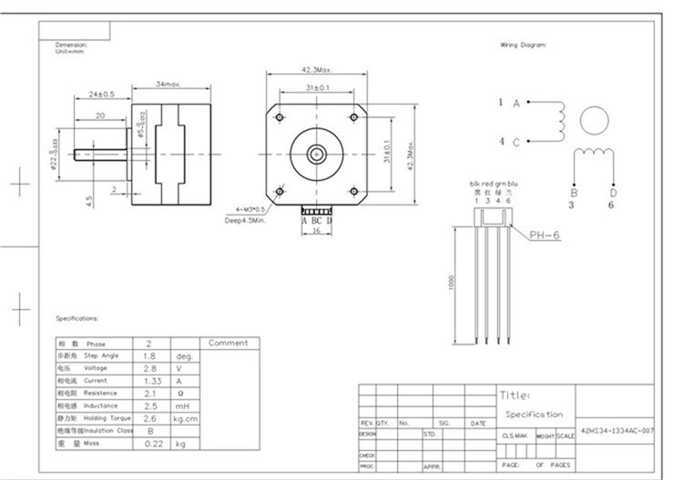

# Escriba Mark I - Light CNC

[Change log](CHANGELOG.md)

[Bill of materials](BOM.md)

[Kanban](KANBAN.md)

# Introduction

## Technical specifications

Dimensions:
- Width:  mm (calculated)
- Height:  mm (calculated)
- Depth:  mm (calculated)

Mass:
- Weight:  g (calculated)

Maximum travel:
- x axis: 394,20 mm (calculated)
- y axis: 213.15 mm (calculated)
- z axis: 0.0 mm (calculated)

# Mechanics


### SHF8


Technical specifications:
- Shaft: 8 mm
- Fastener: M5
- Material: aluminium

### SC8VUU
Technical specifications:
- Shaft: 8 mm
- Fastener: M3
- Material: aluminium
- System: LM8UU

## Belt


Technical specifications:
- Standard: GT2
- Pinch: 2 mm
- Wide: 6 mm
- Lenght:  mm

## Noise reduction

# Electronics

## Power supply
Technical specifications:
- Voltage: 12 VDC
- Amperage: 5 A
- Interface: P8 (+ out, - in)

## Arduino
Technical specifications:
- [Arduino Uno] R3

### Diagram
                                 .-----.
    .----[PWR]-------------------| USB |--.
    |                            '-----'  |
    |         GND/RST2  [ ][ ]            |
    |       MOSI2/SCK2  [ ][ ]  A5/SCL[ ] |   C5
    |          5V/MISO2 [ ][ ]  A4/SDA[ ] |   C4
    |                             AREF[ ] |
    |                              GND[ ] |
    | [ ]NC                     SCK/13[ ] |   B5
    | [ ]v.ref                 MISO/12[ ] |   .
    | [ ]RST                   MOSI/11[ ]~|   .
    | [ ]3V3    +---+               10[ ]~|   .
    | [ ]5v     | A |                9[ ]~|   .
    | [ ]GND   -| R |-               8[ ] |   B0
    | [ ]GND   -| D |-                    |
    | [ ]Vin   -| U |-               7[ ] |   D7
    |          -| I |-               6[ ]~|   .
    | [ ]A0    -| N |-               5[ ]~|   .
    | [ ]A1    -| O |-               4[ ] |   .
    | [ ]A2     +---+           INT1/3[ ]~|   .
    | [ ]A3                     INT0/2[ ] |   .
    | [ ]A4/SDA  RST SCK MISO     TX>1[ ] |   .
    | [ ]A5/SCL  [ ] [ ] [ ]      RX<0[ ] |   D0
    |            [ ] [ ] [ ]              |
    '--.                         .--------'
        \_______________________/

Diagram by http://busyducks.com/ascii-art-arduinos

### Pin designation
 id | pin |   type    | direction |               description
----|-----|-----------|-----------|--------------------------------------------
  0 |   0 | digital   | input     | Serial communication
  1 |   1 | digital   | output    | Serial communication
  2 |   0 | digital   | output    | Step Pulse x-axis
  3 |   3 | digital   | output    | Step Pulse y-axis
  4 |   4 | digital   | output    | Step Pulse z-axis
  5 |   5 | digital   | output    | Direction x-axis
  6 |   6 | digital   | output    | Direction y-axis
  7 |   7 | digital   | output    | Direction z-axis
  8 |   8 | digital   | output    | Stepper Enable/Disable
  9 |   9 | digital   | input     | Limit x-axis
 10 |  10 | digital   | input     | Limit y-axis
 11 |  11 | PWM       | input     | Limit z-axis
 12 |  12 | digital   | output    | Spindle Enable
 13 |  13 | digital   | output    | Spindle Direction
 14 |   0 | digital   | input     | Reset/Abort
 15 |   1 | digital   | input     | Feed Hold
 16 |   2 | digital   | input     | Cycle Start/Resume
 17 |   3 | digital   | output    | Coolant Enable
 18 |   4 | digital   | input     | (not used/reserved)
 19 |   5 | digital   | input     | Probe

## CNC Shield


[CNC/Stepper Motor Shield](Documents/cnc-3axis-shield.pdf)

Technical specifications:
- Version: 3.00

Connected at:
- Arduino: Digital Pin 11
- CNC Shield: Z+ end stop pin

## Stepper drivers
CNC Shield has 3 jumpers to configure each axes resolution.
That can be set to configure the motor micro stepping.

### Resolution configuration

#### Pololu A4988
 M0   | M1   | M2   | Microstep resolution
------|------|------|-----------------------
 Low  | Low  | Low  | Full step
 High | Low  | Low  | Half step
 Low  | High | Low  | Quarter step
 High | High | Low  | Eighth step
 High | High | High | Sixteenth step

#### Pololu DRV8825
 M0   | M1   | M2   | Microstep resolution
------|------|------|-----------------------
 Low  | Low  | Low  | Full step
 High | Low  | Low  | Half step
 Low  | High | Low  | 1/4 step
 High | High | Low  | 1/8 step
 Low  | Low  | High | 1/16 step
 High | Low  | High | 1/32 step
 Low  | High | High | 1/32 step
 High | High | High | 1/32 step

## Step motors


Technical specifications:
- Model: JK42HS34-1334AC
- Phase: 2
- Step angle: 1.8 degrees (200 steps/revolution)
- Rated voltage: 2.8 V
- Current/Phase: 1.33 A
- Resistance/Phase: 2.1 Ω
- Inductance/Phase: 2.5 mH
- Holding Torque: 22 N·cm (2.6 kg·cm)
- Outlet: 4 wires
- Shaft: 5 mm single flat
- Size (metric): 4.2 cm x 4.2 cm x 3.4 cm
- Size (imperial): 1.65" x 1.65" x 1.34"


# Software

## Grbl
> "Grbl is a no-compromise, high performance, low cost alternative to parallel-port-based motion control for CNC milling. It will run on a vanilla Arduino (Duemillanove/Uno) as long as it sports an Atmega 328.
>
> The controller is written in highly optimized C utilizing every clever feature of the AVR-chips to achieve precise timing and asynchronous operation. It is able to maintain up to 30kHz of stable, jitter free control pulses.
>
> It accepts standards-compliant g-code and has been tested with the output of several CAM tools with no problems. Arcs, circles and helical motion are fully supported, as well as, all other primary g-code commands. Macro functions, variables, and most canned cycles are not supported, but we think GUIs can do a much better job at translating them into straight g-code anyhow.
>
> Grbl includes full acceleration management with look ahead. That means the controller will look up to 18 motions into the future and plan its velocities ahead to deliver smooth acceleration and jerk-free cornering."
>
> -- From: [Grbl web page]

### Configuring
Set the baud rate to 115200 as 8-N-1 (8-bits, no parity, and 1-stop bit.)

[Grbl configuring]

### G-Code
List of Supported G-Codes in Grbl v1.1:
  - Non-Modal Commands: G4, G10L2, G10L20, G28, G30, G28.1, G30.1, G53, G92, G92.1
  - Motion Modes: G0, G1, G2, G3, G38.2, G38.3, G38.4, G38.5, G80
  - Feed Rate Modes: G93, G94
  - Unit Modes: G20, G21
  - Distance Modes: G90, G91
  - Arc IJK Distance Modes: G91.1
  - Plane Select Modes: G17, G18, G19
  - Tool Length Offset Modes: G43.1, G49
  - Cutter Compensation Modes: G40
  - Coordinate System Modes: G54, G55, G56, G57, G58, G59
  - Control Modes: G61
  - Program Flow: M0, M1, M2, M30*
  - Coolant Control: M7*, M8, M9
  - Spindle Control: M3, M4, M5
  - Valid Non-Command Words: F, I, J, K, L, N, P, R, S, T, X, Y, Z

### Control

#### Spindle
Spindle are controled using PWM PIN 11 to drive the tool.

Use the command Sxxx (xxx between 0 and 2500) to:
  - Set laser (2500 mW) intensity.
  - Rotate servo between 0 and 180 degrees.

##### M3
- Constant laser power mode simply keeps the laser power as programmed, regardless if the machine is moving, accelerating, or stopped. This provides better control of the laser state. With a good G-code program, this can lead to more consistent cuts in more difficult materials.

- For a clean cut and prevent scorching with M3 constant power mode, it's a good idea to add lead-in and lead-out motions around the line you want to cut to give some space for the machine to accelerate and decelerate.

NOTE: M3 can be used to keep the laser on for focusing.

##### M4
- Dynamic laser power mode will automatically adjust laser power based on the current speed relative to the programmed rate. It essentially ensures the amount of laser energy along a cut is consistent even though the machine may be stopped or actively accelerating. This is very useful for clean, precise engraving and cutting on simple materials across a large range of G-code generation methods by CAM programs. It will generally run faster and may be all you need to use.

- Grbl calculates laser power based on the assumption that laser power is linear with speed and the material. Often, this is not the case. Lasers can cut differently at varying power levels and some materials may not cut well at a particular speed and/power. In short, this means that dynamic power mode may not work for all situations. Always do a test piece prior to using this with a new material or machine.

- When not in motion, M4 dynamic mode turns off the laser. It only turns on when the machine moves. This generally makes the laser safer to operate, because, unlike M3, it will never burn a hole through your table, if you stop and forget to turn M3 off in time.

##### M5
The command M05 set PWM to PIN 11 to zero.

##### Aditional information
You can change the pulse duration in the file spindle_control.c:

``` c++
define RC_SERVO_SHORT 15 // Timer ticks for 0.6ms pulse duration (9 for 0.6ms)
define RC_SERVO_LONG 32 // Timer ticks for 2.5 ms pulse duration (39 for 2.5ms)
define RC_SERVO_INVERT 1 // Uncomment to invert servo direction
```
If you want to have the servo working from 0 --> 180 degrees change RC_SERVO_SHORT and put 9, RC_SERVO_LONG and put 39 If you want invert the servo direction uncomment the line above.

https://github.com/gnea/grbl/wiki/Grbl-v1.1-Laser-Mode

https://github.com/gnea/grbl/wiki/Grbl-v1.1-Jogging

https://github.com/gnea/grbl/wiki/Grbl-v1.1-Configuration

#### Fan

##### M8

##### M9

# Tools

## Pen holder


Technical specifications:
- Material: ABS (3D printed) and steel

## Laser


Technical specifications:
- Power: 2.5 W
- Voltage: 12 VDC
- Version: 2
- PWM: Yes

### Draw
 Material  | Power (mW) | Feed (ms)
-----------|------------|-----------
 Paper     |        980 |      1000
 Cardboard |            | 
 Foarm     |            | 
 Wood      |            | 
 Leather   |            | 
 Acrilic   |            | 


---

[Arduino Uno]: https://www.arduino.cc/en/Main/arduinoBoardUno/#techspecs
[Grbl web page]: https://github.com/gnea/grbl
[Grbl configuring]: https://github.com/gnea/grbl/wiki/Grbl-v1.1-Configuration
