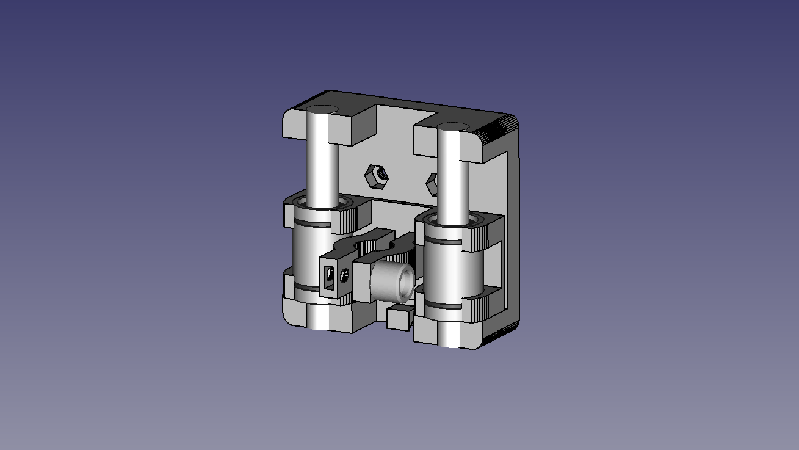
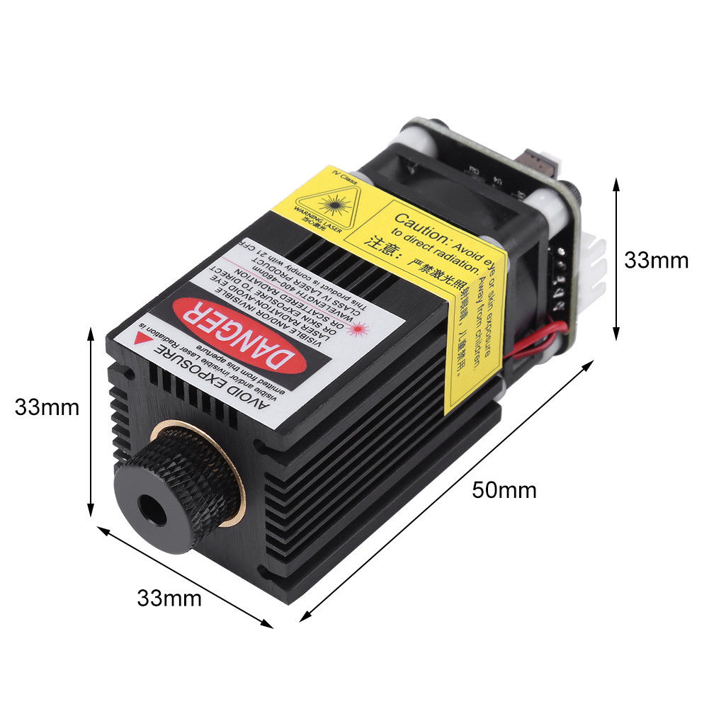

# Escriba Mark I - Light CNC

[Main page]

## Tools

### Pen
Pen holder

<!---
Technical specifications:
- Material: ABS (3D printed) and steel
--->

### Laser

Technical specifications:
- Power: 2.5 W
- Voltage: 12 VDC
- Version: 2
- PWM: Yes

<!---
#### Draw
 Material  | Power (mW) | Feed (ms)
-----------|------------|-----------
 Paper     |        980 |      1000
 Cardboard |            | 
 Foarm     |            | 
 Wood      |            | 
 Leather   |            | 
 Acrilic   |            | 
--->

[Main page]

---

[Main page]: ../README.md
